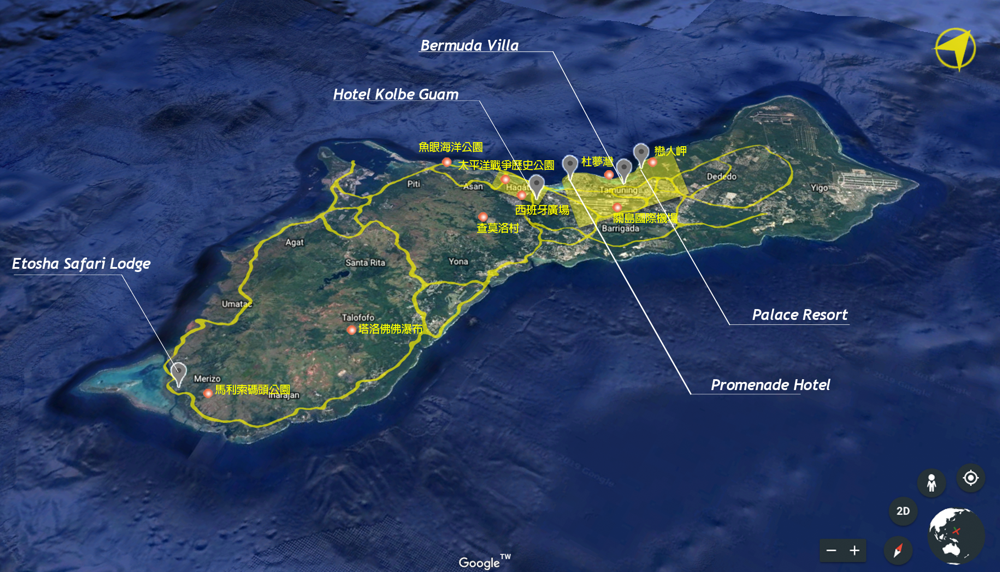

# vr-intro

婉寧學姊的 `Google Cardboard` + `Youtube VR Videos` 實驗

-   boracay <https://bob-lab.github.io/vr-intro/#boracay>
    -   
    -   介紹 <https://www.youtube.com/watch?v=AmKiNaFvSb8>
    -   hotel 1 BW: <https://www.youtube.com/watch?v=WOPSsboPAXQ>
    -   hotel 2 B&B: <https://www.youtube.com/watch?v=zhqSCX8ab3A>
    -   hotel 3 Wartburger: <https://www.youtube.com/watch?v=EuV6veRPhdE>
    -   hotel 4 Ditholo: <https://www.youtube.com/watch?v=CV400h8IsRQ>
    -   hotel 5 Devonshire: <https://www.youtube.com/watch?v=wEpeZkU4b1M>
-   guam <https://bob-lab.github.io/vr-intro/#boracay>
    -   
    -   hotel 1 Bermuda Villa: <https://www.youtube.com/watch?v=y2R7H74poq8>
    -   hotel 2 Palace Resort: <https://www.youtube.com/watch?v=ec9lLFoJDmA>
    -   hotel 3 Hotel Kolbe Guam: <https://www.youtube.com/watch?v=oJntGDahits>
    -   hotel 4 Promenade Hotel: <https://www.youtube.com/watch?v=Sv9L8BB6nK8>
    -   hotel 5 Etosha Safari Lodge: <https://www.youtube.com/watch?v=5JQS1Xy9fS>
